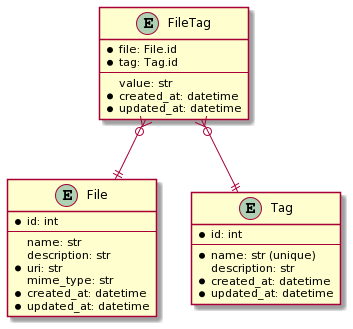
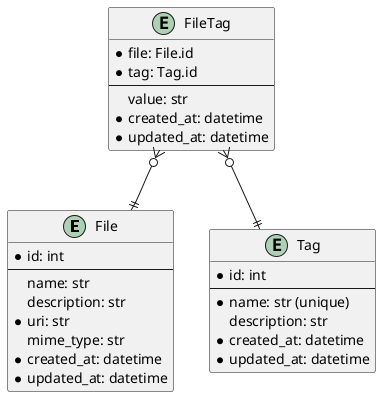

# tag-utility

> **WARNING:** `tag` is a work in progress! Use at your own risk!

`tag` is a CLI utility (and Python library) for organizing files in a non-hierarchical way using... guess what... *tags*!

A simple example:

``` bash
# adds the tag "foo" to myphoto.jpg
tag add -t foo myphoto.jpg

# prints myphoto.jpg
tag ls foo
```

Tags can be simple annotations (e.g. `foo`) or they can be more like a label with a value (e.g. `foo=bar`). However, the latter case isn't fully supported yet.

Tag data are stored in a SQLite database (called a *tag database*) with a simple, well-documented schema (see the [Database Schema](#Database_Schema) section). 

The `tag` utility applies an "open" design principle, allowing the user to interact with their tag data at whatever level they choose:

1. The `tag` CLI (highest level)
2. Python library API (high level)
3. The SQLite database (low level)

`tag` uses this "open" design to make it easy to slot into my (or others') existing workflows. No application design is truly unopinionated, so by providing simple access to the data, we enable power-users to design their own tools and applications instead of being beholden to the `tag` CLI design itself.

The primary advantage `tag` exhibits over standardized data formats like JSON, is performance with large datasets. By taking advantage of relational database features like indexes, `tag` maintains a short start-up time and snappy responses even if the database has many thousands of tags.

# Getting Started

Requirements:

* Python 3.8+ (tested with v3.8.2)
* Pip (tested with v20.0.2)
* Git (tested with v2.25.1)

Installation:

``` bash
pip install git+https://github.com/luketurner/tag-utility.git
```

Then you should be able to run:

``` bash
tag --help
```

Next, you need to create a tag database.

By default, an `index.tag.sqlite` database file will be created in the current directory when you run any (non-help) command.

Depending on your use-case, you may wish to explicitly create a database in a certain place with the `--database`/`-d` option. For example, you could create a "home database" in `~/home.tag.sqlite`:

``` bash
tag -d ~/home.tag.sqlite info
```

(Note -- any `tag` command will automatically create a database. In this case we're running `tag info` because it has no other side-effects once the database is created.)

Once we've created a database, `tag` will default to using that database when running in that directory or any subdirectory.

Now, run `tag --help` to see what other commands are available. You can also pass `--help` to a subcommand (e.g. `tag info --help`) to view detailed help for that subcommand.

# CLI Usage

CLI documentation from `tag --help` can be seen below. (Note, this doesn't include all the documentation for subcommands.)

```
Usage: tag [OPTIONS] COMMAND [ARGS]...

  tag is a utility for organizing files in a non-hierarchical way using...
  guess what... *tags*!

  More specifically, tag provides a CLI for making and interacting with *tag
  databases*, which are SQLite files with a certain schema.

  For example:

      # adds tag to foo.pdf
      tag add -t foobar foo.pdf

      # prints foo.pdf
      tag ls foobar

Options:
  -d, --database PATH        Path to the database to use. If it doesn't exist,
                             it will be created. If unspecified, the first
                             .tag.sqlite file found in the current directory
                             (or its parents) will be used. If no databases
                             are found or specified, the default
                             index.tag.sqlite database will be used (and
                             created if missing).

  -o, --output [plain|json]  Output format to use. The default is 'plain',
                             which has a simple Unixy format. The 'json'
                             format includes more information.

  --version                  Show the version and exit.
  --help                     Show this message and exit.

Commands:
  add   Adds file(s) to the database with given tags.
  info  Outputs details about the tag database.
  ls    Outputs all the files tagged with given tag(s).
  rm    Removes files and/or tags from the database.
  show  Outputs details about file(s) in the database.
```

# Python Library Usage

The `tag` utility can also be imported and used as a Python library. 

Simple usage example:

``` python
import tag

tag.connect("mytags.tag.sqlite")

# add mytag=value to file foo.txt
# creates files/tags if they don't already exist
tag.add_filetags("foo.txt", { "mytag": "value" })

# returns the foo.txt file since we tagged it earlier
tag.search_files(tags=["mytag"])

# delete our filetag (but keep the file and tag objects)
tag.delete_filetag("foo.txt", "mytag")

# disconnect (optional)
tag.disconnect()
```

For a full list of the exposed API functions, please read the function documentation in the [source code](tag/__init__.py).

# Database Schema

It's possible to interact with a tag database directly, without using the `tag` utility at all. This approach requires a deeper understanding of the relational structure of the tag data, but it provides the most flexibility and control (while maintaining interoperability with the `tag` utility itself.)

Because I recommend and encourage external tools to interact with tag databases, the SQL schema is considered a public API, not an opaque application concern. This section provides a short explanation of the schema.

A tag database has these tables:

1. The `file` table stores all the things being tagged. The table is called `file` for simplicity, but it may contain embedded data or links outside the local filesystem (e.g. HTTP, Git, S3 links).
2. The `tag` table stores tags. Tags have a unique id besides their name, but their name must also be unique.
3. The `filetag` table stores relations between files and tags. Relations can include a value, which is how `foo=bar` style tags are implemented (the tag name is `foo`, the value is `bar`).





# Development

This section is for folks wanting to make changes to `tag-utility` itself.

Dependencies:

* Python 3.8+
* Poetry (tested with v1.0.5)
* Git (tested with v2.25.1)

First, clone the repository and install dependencies:

``` bash
git clone https://github.com/luketurner/tag-utility.git

cd tag-utility

poetry install
```

Then, you should be able to run `tag --help` using:

``` bash
poetry run tag --help
```

`tag` roughly hews to a test-driven development style. The test suite is run with:

``` bash
poetry run pytest
```

When new features or bugfixes are contributed, the changes must have accompanying acceptance tests if possible.

Code formatting is provided by `black`:

``` bash
poetry run black tag
poetry run black tests
```