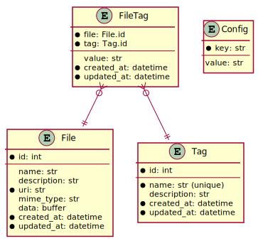
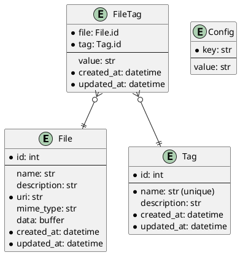

# tag-utility

> **WARNING:** `tag` is a work in progress! Use at your own risk!

`tag` is a CLI utility (and Python library) for organizing files in a non-hierarchical way using... guess what... *tags*!

I created `tag` because I wanted a file-tagging program that:

1. Is unopinionated about what GUI I should use to view the files.
2. Plays nicely with the ecosystem of Unixy tools (`cat`, `vim`, `bash`, etc.).
3. Can search 10,000-file databases without noticeable lag.
4. Can store tag data in the same directory tree as the files being tagged.

A simple example:

``` bash
# adds the tag "foo" with value "bar" to myphoto.jpg
tag add -t foo=bar myphoto.jpg

# opens myphoto.jpg in feh image viewer
tag ls foo | feh -f -
```

Tags are stored in SQLite database(s) using a well-defined schema (called a *tag database*). Tags can be bare annotations (e.g. `foo`) or they can have a value (e.g. `foo=bar`).

The `tag` utility is open-source and MIT licensed.

# Getting Started

Requirements:

* Python 3.8+ (tested with v3.8.2)
* Pip (tested with v20.0.2)
* Git (tested with v2.25.1)

Installation:

``` bash
pip install git+https://github.com/luketurner/tag-utility.git
```

Then you should be able to run:

``` bash
tag --help
```

Next, you need to create a tag database.

By default, an `index.tag.sqlite` database file will be created in the current directory when you run any (non-help) command.

Depending on your use-case, you may wish to explicitly create a database in a certain place with the `--database`/`-d` option. For example, you could create a "home database" in `~/home.tag.sqlite`:

``` bash
tag -d ~/home.tag.sqlite info
```

Once we've created a database, `tag` will default to using that database when running in that directory or any subdirectory.

Now, run `tag --help` to see what other commands ara available. You can pass `--help` to a subcommand (e.g. `tag info --help`) to view detailed help for that subcommand.

# CLI Usage

CLI documentation from `tag --help` can be seen below. (Note, this doesn't include all the documentation for subcommands.)

```
Usage: tag [OPTIONS] COMMAND [ARGS]...

  tag is a utility for organizing files in a non-hierarchical way using...
  guess what... *tags*!

  More specifically, tag provides a CLI for making and interacting with *tag
  databases*, which are SQLite files with a certain schema.

  For example:

      # adds tag to foo.pdf
      tag add -t foobar foo.pdf 

      # prints foo.pdf
      tag ls foobar

Options:
  -d, --database PATH        Path to the database to use. If it doesn't exist,
                             it will be created. If unspecified, the first
                             .tag.sqlite file found in the current directory
                             (or its parents) will be used. If no databases
                             are found or specified, the default
                             index.tag.sqlite database will be used (and
                             created if missing).

  -o, --output [plain|json]  Output format to use. The default is 'plain',
                             which has a simple Unixy format. The 'json'
                             format includes more information.

  --version                  Show the version and exit.
  --help                     Show this message and exit.

Commands:
  add   Adds file(s) to the database with given tags.
  info  Outputs details about the tag database.
  ls    Outputs all the files tagged with given tag(s).
  rm    Removes files and/or tags from the database.
  show  Outputs details about file(s) in the database.
```

# Python Library Usage

The `tag` utility can also be imported and used as a Python library. For now, this is considered a power-user mode and isn't fully documented, nor is the API versioned.

Simple usage example:

``` python
from tag import *

with connect("mytags.tag.sqlite") as conn:
    assert len(get_file_tags(conn, "foo.pdf")) == 0

    add_file_tags(conn, "foo.pdf", { "foo": "baz", "bar": None })
    assert len(get_file_tags(conn, "foo.pdf")) == 2

    delete_file_tags(conn, "foo.pdf", ["bar"])
    assert len(get_file_tags(conn, "foo.pdf")) == 1
```


# Database Schema

A tag database has these tables:

1. The `file` table stores all the things being tagged. The table is called `file` for simplicity, but it may contain embedded data or links outside the local filesystem (e.g. HTTP, Git, S3 links).
2. The `tag` table stores tags. Tags have a unique id besides their name, but their name must also be unique.
3. The `file_tag` table stores relations between files and tags. Relations can include a value, which is how `foo=bar` style tags are implemented (the tag name is `foo`, the value is `bar`).
4. The `config` table holds configuration information for later clients.





# Development

This section is for folks wanting to make changes to `tag-utility` itself.

Dependencies:

* Python 3.8+
* Poetry (tested with v1.0.5)
* Git (tested with v2.25.1)

First, clone the repository and install dependencies:

``` bash
git clone https://github.com/luketurner/tag-utility.git

cd tag-utility

poetry install
```

Then, you should be able to run `tag --help` using:

``` bash
poetry run tag --help
```

`tag` roughly hews to a test-driven development style. The test suite is run with:

``` bash
poetry run pytest
```

When new features or bugfixes are contributed, the changes must have accompanying acceptance tests if possible.

Code formatting is provided by `black`:

``` bash
poetry run black tag
poetry run black tests
```