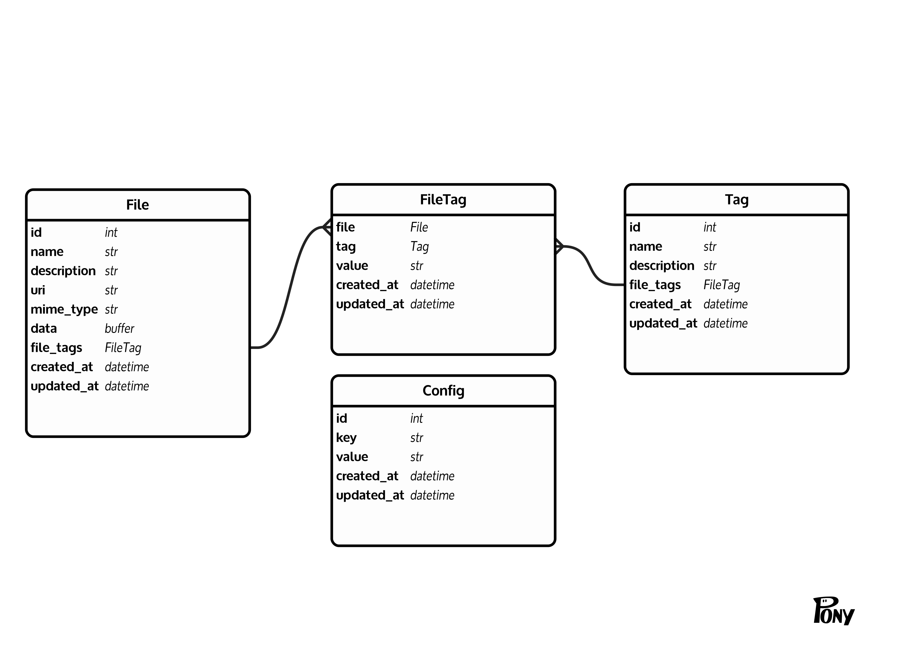

# tag-utility

> **WARNING:** `tag` is a work in progress! Use at your own risk!

`tag` is a CLI utility for organizing files in a non-hierarchical way using... *tags*. (Surprise!) A simple example:

``` bash
# adds the tag "foo" with value "bar" to myphoto.jpg
tag add -t foo=bar myphoto.jpg

# opens myphoto.jpg in feh image viewer
tag ls foo | feh -f -
```

Tags are stored in SQLite database(s) using a well-defined schema. They can be bare annotations (e.g. `foo`) or they can have a value (e.g. `foo=bar`).

The `tag` utility's focused goal is to read and write the data in these files, which are called *tag databases*, in a way that plays nicely with the ecosystem of "UNIXy tools."

## Database Schema

A tag database has these tables:

1. The `file` table stores all the things being tagged. The table is called `file` for simplicity, but it may contain embedded data or links outside the local filesystem (e.g. HTTP, Git, S3 links).
2. The `tag` table stores tags. Tags have a unique id besides their name, but their name must also be unique.
3. The `file_tag` table stores relations between files and tags. Relations can include a value, so this is a little more simple than a pure join table.
4. The `config` table holds configuration information for later clients.




## Development

The following commands are useful when doing development against `tag` itself:

``` bash
poetry install          # install deps (run this first)
poetry run pytest       # run tests
poetry run black tag    # format code
poetry run tag          # run `tag` from source
```