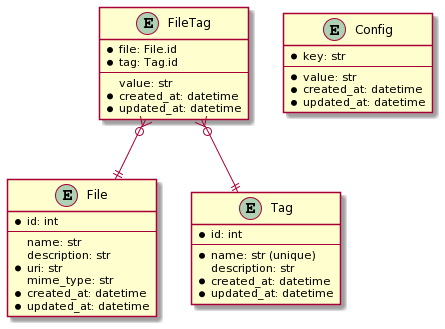

# tag-utility

> **WARNING:** `tag` is a work in progress! Use at your own risk!

`tag` is a CLI utility (and Python library) for organizing files in a non-hierarchical way using... guess what... *tags*!

A simple example:

``` bash
# adds the tag "foo" to myphoto.jpg
tag add -t foo myphoto.jpg

# prints myphoto.jpg
tag ls foo
```

Tags can be simple annotations (e.g. `foo`) or they can be more like a label with a value (e.g. `foo=bar`). However, the latter case isn't fully supported yet.

Tag data are stored in a SQLite database (called a *tag database*) with a simple, well-documented schema (see the [Database Schema](#Database_Schema) section). 

The `tag` utility applies an "open" design principle, allowing the user to interact with their tag data at whatever level they choose:

1. The `tag` CLI (highest level)
2. Python library API (high level)
3. The SQLite database (low level)

`tag` uses this "open" design to make it easy to slot into my (or others') existing workflows. No application design is truly unopinionated, so by providing simple access to the data, we enable power-users to design their own tools and applications instead of being beholden to the `tag` CLI design itself.

The primary advantage `tag` exhibits over standardized data formats like JSON, is performance with large datasets. By taking advantage of relational database features like indexes, `tag` maintains a short start-up time and snappy responses even if the database has many thousands of tags.

# Getting Started

Requirements:

* Python 3.8+ (tested with v3.8.2)
* Pip (tested with v20.0.2)
* Git (tested with v2.25.1)

Installation:

``` bash
pip install git+https://github.com/luketurner/tag-utility.git
```

Then you should be able to run:

``` bash
tag --help
```

Next, you need to create a tag database.

By default, an `index.tag.sqlite` database file will be created in the current directory when you run any (non-help) command.

Depending on your use-case, you may wish to explicitly create a database in a certain place with the `--database`/`-d` option. For example, you could create a "home database" in `~/home.tag.sqlite`:

``` bash
tag -d ~/home.tag.sqlite info
```

(Note -- any `tag` command will automatically create a database. In this case we're running `tag info` because it has no other side-effects once the database is created.)

Once we've created a database, `tag` will default to using that database when running in that directory or any subdirectory.

Now, run `tag --help` to see what other commands are available. You can also pass `--help` to a subcommand (e.g. `tag info --help`) to view detailed help for that subcommand.

# CLI Usage

CLI documentation from `tag --help` can be seen below. (Note, this doesn't include all the documentation for subcommands.)

<!-- gendocs cli help start -->
```
Usage: tag [OPTIONS] COMMAND [ARGS]...

  tag is a utility for organizing files in a non-hierarchical way using...
  guess what... *tags*!

  More specifically, tag provides a CLI for making and interacting with *tag
  databases*, which are SQLite files with a certain schema.

  For example:

      # adds tag to foo.pdf
      tag add -t foobar foo.pdf 

      # prints foo.pdf
      tag ls foobar

Options:
  -d, --database PATH        Path to the database to use. If it doesn't exist,
                             it will be created. If unspecified, the first
                             .tag.sqlite file found in the current directory
                             (or its parents) will be used. If no databases
                             are found or specified, the default
                             index.tag.sqlite database will be used (and
                             created if missing).

  -o, --output [plain|json]  Output format to use. The default is 'plain',
                             which has a simple Unixy format. The 'json'
                             format includes more information.

  --version                  Show the version and exit.
  --help                     Show this message and exit.

Commands:
  add     Adds file(s) to the database with given tags.
  config  Gets/sets the value for the given config key(s).
  info    Outputs details about the tag database.
  ls      Outputs all the files tagged with given tag(s).
  rm      Removes files and/or tags from the database.
  show    Outputs details about file(s) in the database.
```
<!-- gendocs cli help end -->

# Python Library Usage

The `tag` utility can also be imported and used as a Python library. 

Simple usage example:

``` python
import tag

tag.connect("mytags.tag.sqlite")

# add mytag=value to file foo.txt
# creates files/tags if they don't already exist
tag.add_filetags("foo.txt", { "mytag": "value" })

# returns the foo.txt file since we tagged it earlier
tag.search_files(tags=["mytag"])

# delete our filetag (but keep the file and tag objects)
tag.delete_filetag("foo.txt", "mytag")

# disconnect (optional)
tag.disconnect()
```

## Library API Reference

<!-- gendocs api start -->
##### **version**()

Returns a human-readable version string.

##### **version_info**()

Returns a tuple representation of the version, with three numbers: (major, minor, patch).

##### **database_version_info**()

Returns a 3-tuple -- e.g. (1, 2, 3) -- that represents the current version
of the database schema. This is loaded from the database's config table, so there must be an
open connection for this function to work, unlike the other version functions in this module.
However, if the config table doesn't exist, this will return the default value (0, 0, 0).

##### **connect**(filename, auto_migrate=False)

Opens a connection to the SQLite database specified by filename, which may or may not already exist.
If the migration argument is True, the database schema will be created.

##### **migrate**(dry_run=False)

This function "updates" the tag database to the current `tag` version by running any migrations that may be missing.
For reasons of simplicity, migrations are not given their own table to track which are applied. Instead, this function will look
up the version in the database and only run migrations with a later version number than that. Also for simplicity, rollbacks are not supported.

Migrations are safe to run on any database, if already run they will be a no-op. If the database has never been used before (empty schema),
migrate() will run all migrations to bring it up to date. If the database is a newer version than this codebase, migrate() is a no-op.

If dry_run is True, this function will return a list of migration task names instead of calling them. Useful for determining which migrations will be
run ahead-of-time.

##### **disconnect**()

Closes the open SQLite connection, if any.

##### **get_config_value**(key)

Returns the value for the given config key,
or None if the key doesn't exist in the database. (Also returns None when the config table doesn't exist yet.)
Config keys should be strings, and the returned value will be a string (or None).

##### **set_config_value**(key, value)

Sets the config `key` to the given `value`, overwriting any existing values.
Both key and value should be strings.

##### **add_file**(filename, description=None, mime_type=None, name=None)

Adds a `file` object to the tag database.
If a file object already exists with the same filename, that object will be updated instead of creating a new one.
If mime_type is not specified, will attempt to guess the MIME type of the file based on its extension.
If name is not specified, will default to the file's basename (e.g. "foo.txt.").

##### **add_tag**(name, description=None)

Adds a tag to the tag database. (Note -- this doesn't associate the tag with any files. Use add_filetags for that.)
If a tag with the same name already exists, the existing tag will be used instead of creating a new one.

##### **add_filetags**(filename, tags, create_tags=True, create_file=True)

Adds one or more filetags to the tag database. The filetags are linked to the file given by `filename`.
The `tags` parameter should be a dict where keys are tag names and values are filetag data (or None to indicate no filetag data.)
By default, this function will automatically create the associated file and tag records as well if they are missing.
To disable this behavior (i.e. to create _only_ filetags), use the create_tags and create_file parameters.

##### **get_file**(filename)

Returns the file object given by `filename`.

##### **get_tag**(name)

Returns the tag object given by `name`.

##### **get_filetag**(filename, tagname)

Returns the filetag object that refers to both the given filename and tagname.

##### **get_tags_for_file**(filename, limit=None)

Returns a cursor for all the tags that are associated with `filename`.
The `limit` parameter can be used to control the max number of results to return.

##### **get_files_for_tag**(tagname, limit=None)

Returns a cursor for all the files that are associated with `tagname`.
The `limit` parameter can be used to control the max number of results to return.

##### **delete_file**(filename)

Deletes the specified file object, if it exists. Also deletes any filetags associated with the deleted file.

##### **delete_tag**(name)

Deletes the specified tag object, if it exists. Also deletes any filetags associated with the deleted tag.

##### **delete_filetag**(filename, tagname)

Deletes the specified filetag object, if it exists.

##### **delete_filetags_for_file**(filename)

Deletes all the filetags associated with given `filename`.

##### **delete_filetags_for_tag**(tagname)

Deletes all the filetags associated with given `tagname`.

##### **count_files**()

Returns the number of files in the database.

##### **count_filetags**()

Returns the number of filetags in the database.

##### **count_tags**()

Returns the number of tags in the database.

##### **search_files**(tags=None, exclude_tags=None, mime_types=None, exclude_mime_types=None)

Returns a cursor for all the file objects that match the requested search parameters.
The `tags` parameter should be an array of tag names, ALL of which must match.
For the other parameters (e.g. `exclude_tags` or `mime_types`), ANY of them must match.

<!-- gendocs api end -->

# Database Schema

It's possible to interact with a tag database directly, without using the `tag` utility at all. This approach requires a deeper understanding of the relational structure of the tag data, but it provides the most flexibility and control (while maintaining interoperability with the `tag` utility itself.)

Because I recommend and encourage external tools to interact with tag databases, the SQL schema is considered a public API, not an opaque application concern. In order to assist in writing such external tools, this section provides a short explanation of the schema.

First: The primary table in a tag database is the `filetag` table. Conceptually speaking, "tagging a file" means adding a row to this table. Each row in the `filetag` table has a `file`, a `tag`, and an optional `value`. 

The `value` column is simple text, but the `file` and `tag` columns are foreign keys -- tag databases are organized using a pseudo [star schema](https://en.wikipedia.org/wiki/Star_schema), where the `filetag` table is the "fact table" and the `file` and `tag` tables are dimensions.

The relation between the tables is visualized in the following entity diagram. (This diagram also introduces the `config` table, which is used to hold database-wide configuration values. See the [Config table](#Config_table) section for more information.)



(Note -- full schema visible in the [migrations.sql](tag/migrations.sql) file.)

With this approach, the `file` and `tag` tables normalize the metadata about all the files/tags in the system. If, for example, you wanted to change the location of a file, you can do so by changing a single row in the `file` table without changing every single `filetag` associated with that row.

For example, consider the following API call -- which is also equivalent to `tag add foo.txt -t foo=bar` on the CLI:

``` python
tag.add_filetags("foo.txt", { "foo": "bar" })
```

In this case, we wish to create a `filetag` that links the `foo.txt` file with the `foo` tag. But in order to do that, we first need to ensure that those file and tag rows exist in the database. (The `add_filetags` function handles this for us automatically, but if we're manually interacting with the SQL, we have to create all the rows ourselves.)

When we're done, the rows in the database should look like this:

### filetag
| file | tag | value |
|------|-----|-------|
| 1    | 1   | bar   |

### file
| id   | name | uri   |
|------|------|-------|
| 1    | foo.txt | file:///home/luke/foo.txt

### tag
| id   | name |
|------|------|
| 1    | foo

The `tag` utility heavily relies on SQL to implement library functions. If you wonder "how to do X with a tag database," I recommend using the SQL statements in [queries.sql](tag/queries.sql) as a starting point.

## Config table

The `config` table holds database-wide, key-value configuration. The following keys are recommended for clients to understand:

- **tag_version** - Contains the version number of the `tag` utility that created this database. Clients can check this value at startup to ensure they are operating with a compatible database schema.

Besides the above keys, clients can add their own config with application-specific data. Well-behaved clients should:

1. Format their config keys like: `appname_keyname`.
2. Avoid using keys beginning with `tag` (e.g. `tag_prefix`) for application-specific data. Any future official keys will use the `tag` prefix, to minimize risk of conflict.
3. Silently ignore any unknown config keys, even if they have the same application prefix.

## Entity Diagram Source


# Development

This section is for folks wanting to make changes to `tag-utility` itself.

Dependencies:

* Python 3.8+
* Poetry (tested with v1.0.5)
* Git (tested with v2.25.1)

First, clone the repository and install dependencies:

``` bash
git clone https://github.com/luketurner/tag-utility.git

cd tag-utility

poetry install
```

Then, you should be able to run `tag --help` using:

``` bash
poetry run tag --help
```

`tag` roughly hews to a test-driven development style. The test suite is run with:

``` bash
poetry run pytest
```

When new features or bugfixes are contributed, the changes must have accompanying acceptance tests if possible.

Code formatting is provided by `black`:

``` bash
poetry run black tag
poetry run black tests
```